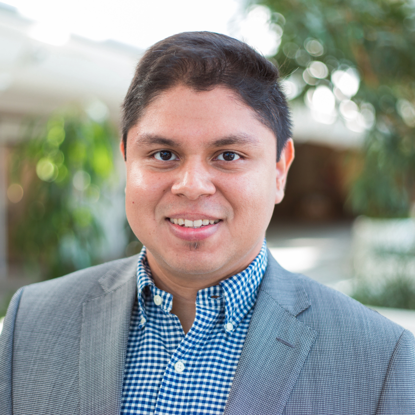

[Home](index.html) | [Papers](papers.html) | [Participants](participants.html) | [Resource](resource.html) | [News](news.html)

# Participants
This is a list of all SciStream participants (by __alphabetical__ order of last name). 

---

## PI

[Rajkumar Kettimuthu, Argonne National Laboratory](http://www.mcs.anl.gov/~kettimut/) 

Rajkumar Kettimuthu is a Computer Scientist at Mathematics and Computer Science Division at Argonne National Laboratory and a Senior Fellow at the Computation Institue at The University of Chicago and Argonne National Laboratory. 

---

## Investigators

---

[Zhengchun Liu](https://lzhengchun.github.io/), [Argonne National Laboratory](http://www.mcs.anl.gov/~zcliu/) and [The University of Chicago](https://www.uchicago.edu)

Zhengchun Liu is an Assistant Computer Scientist at the Data Science and Learning division of Argonne National Laboratory, and a Scientist At-Large of the Consortium for Advanced Science and Engineering at The University of Chicago. Before this, he was a research scientist at the University of Chicago from 2018.03 to 2019.08, and a Postdoc at the Mathematics and Computer Science division of Argonne National Laboratory from 2016.09 to 2018.03.

---

[Joaquin Chung, Argonne National Laboratory](https://www.anl.gov/profile/joaquin-chung)

Joaquin Chung is a postdoctoral appointee at the Data Science and Learning Division at Argonne National Laboratory. He received both his B.S. in Electronics and Communications Engineering (2007) and his M.Sc. in Communication Systems Engineering with Emphasis in Data Networks (2013) from University of Panama, Panama. He received his Ph.D in Electrical and Computer Engineering under the supervision of Dr. Henry Owen and Dr. Russ Clark at Georgia Institute of Technology, Atlanta, USA in December 2017. He is a Fulbright alumn, an IEEE member, and an ACM member. His research interests include software-defined networking, software-defined exchanges, cyber-infrastructure orchestration, edge computing, network security, and quantum communication networks.

---
