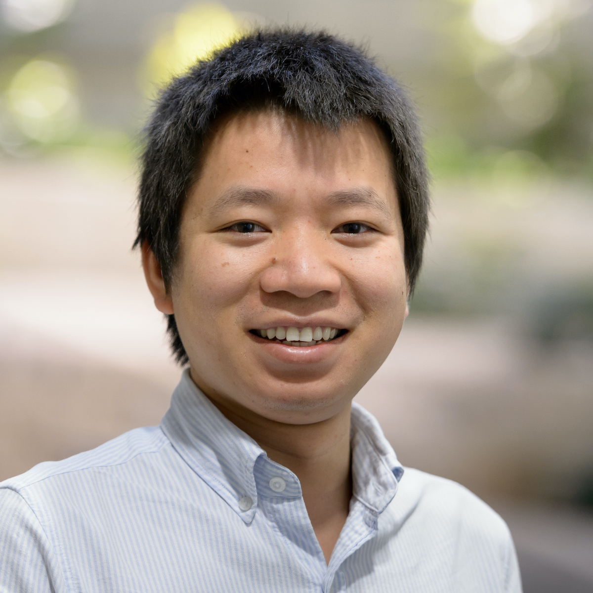

[Home](index.html) | [Papers](papers.html) | [Participants](participants.html) | [Resource](resource.html) | [News](news.html)

# Participants
This is a list of all AMASE participants (by __alphabetical__ order of last name). 

---

## PI

[Rajkumar Kettimuthu, Argonne National Laboratory](http://www.mcs.anl.gov/~kettimut/) 

Rajkumar Kettimuthu is a Computer Scientist at Mathematics and Computer Science Division at Argonne National Laboratory and a Senior Fellow at the Computation Institue at The University of Chicago and Argonne National Laboratory. 

---

## Investigators

---

[Zhengchun Liu](https://lzhengchun.github.io/), [Argonne National Laboratory](http://www.mcs.anl.gov/~zcliu/) and [The University of Chicago](https://www.uchicago.edu)

Zhengchun Liu is a Research Scientist at the Computation Institute of the University of Chicago. He also holds a Joint Appointment at the Data Science and Learning division of Argonne National Laboratory. In this project, he develops end-to-end analytical performance models to transform understanding of the behavior of science workflows in extreme-scale science environments. More specifically, these models are developed to predict the behavior of a science workflow before it is implemented, to explain why performance does not meet design goals, and to architect science environments to meet workflow needs.

---

